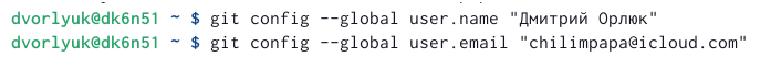
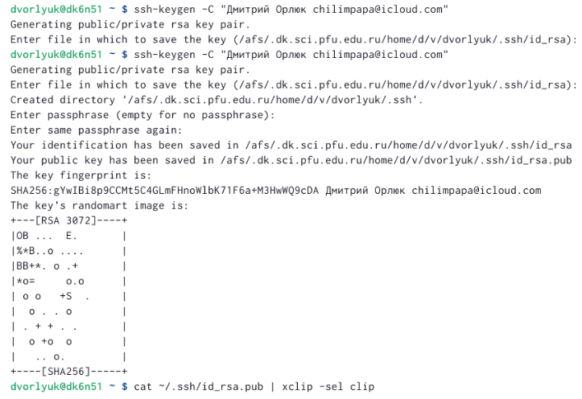
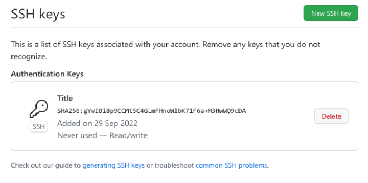
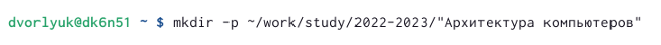
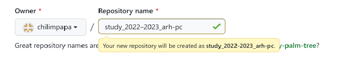
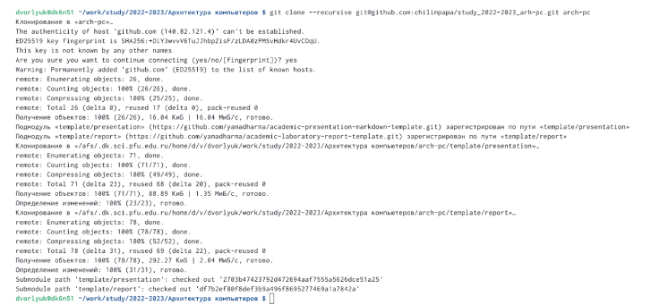
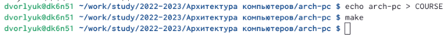
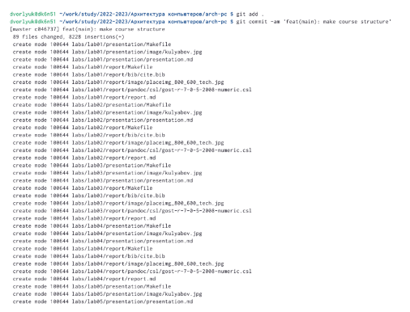
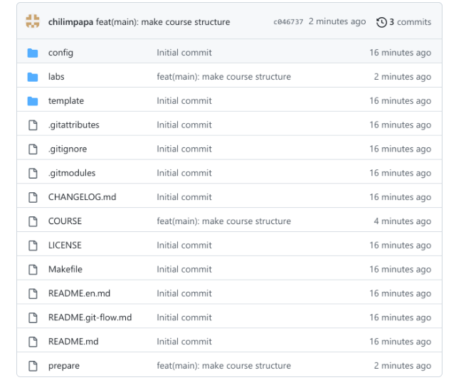

---
## Front matter
title: "Отчет по лабораторной работе №2"
subtitle: "Архитектура вычислительных систем"
author: "Дмитрий Владимирович Орлюк"

## Generic otions
lang: ru-RU
toc-title: "Содержание"

## Bibliography
bibliography: bib/cite.bib
csl: pandoc/csl/gost-r-7-0-5-2008-numeric.csl

## Pdf output format
toc: true # Table of contents
toc-depth: 2
lof: true # List of figures
lot: true # List of tables
fontsize: 12pt
linestretch: 1.5
papersize: a4
documentclass: scrreprt
## I18n polyglossia
polyglossia-lang:
  name: russian
  options:
	- spelling=modern
	- babelshorthands=true
polyglossia-otherlangs:
  name: english
## I18n babel
babel-lang: russian
babel-otherlangs: english
## Fonts
mainfont: PT Serif
romanfont: PT Serif
sansfont: PT Sans
monofont: PT Mono
mainfontoptions: Ligatures=TeX
romanfontoptions: Ligatures=TeX
sansfontoptions: Ligatures=TeX,Scale=MatchLowercase
monofontoptions: Scale=MatchLowercase,Scale=0.9
## Biblatex
biblatex: true
biblio-style: "gost-numeric"
biblatexoptions:
  - parentracker=true
  - backend=biber
  - hyperref=auto
  - language=auto
  - autolang=other*
  - citestyle=gost-numeric
## Pandoc-crossref LaTeX customization
figureTitle: "Рис."
tableTitle: "Таблица"
listingTitle: "Листинг"
lofTitle: "Список иллюстраций"
lotTitle: "Список таблиц"
lolTitle: "Листинги"
## Misc options
indent: true
header-includes:
  - \usepackage{indentfirst}
  - \usepackage{float} # keep figures where there are in the text
  - \floatplacement{figure}{H} # keep figures where there are in the text
---

# Цель работы

Целью работы является изучить идеологию и применение средств контроля
версий. Приобрести практические навыки по работе с системой git.

# Задание

1. Создайте отчет по выполнению лабораторной работы в соответствующем
каталоге рабочего пространства (labs>lab03>report).
2. Скопируйте отчеты по выполнению предыдущих лабораторных работ в
соответствующие каталоги созданного рабочего пространства.
3. Загрузите файлы на github.

# Теоретическое введение

Системы контроля версий (Version Control System, VCS) применяются при
работе нескольких человек над одним проектом. Обычно основное дерево про-
екта хранится в локальном или удалённом репозитории, к которому настроен
доступ для участников проекта. При внесении изменений в содержание проекта
система контроля версий позволяет их фиксировать, совмещать изменения,
произведённые разными участниками проекта, производить откат к любой
более ранней версии проекта, если это требуется.

# Выполнение лабораторной работы

1)Сначала сделаем предварительную конфигурацию git. Откроем терминал и
введем следующие команды, указав свое имя и email:

 {#fig:001 width=90%}
 
2)Настроим utf-8 в выводе сообщений git:
 
 {#fig:002 width=90%}
 
3) Зададим имя начальной ветки (будем называть её master):

{#fig:003 width=90%}
 
4)Параметр autocrlf:

{#fig:004 width=90%}
 
5)Параметр safecrlf:

{#fig:005 width=90%}
 
6) Сгенерируем пару ключей

{#fig:006 width=90%}
 
7) Далее необходимо загрузить сгенерённый открытый ключ. Зайдем на сайт
http://github.org. Скопируем из локальной консоли ключ в буфер обмена

{#fig:007 width=90%}
 
8) Создадим каталог для предмета «Архитектура компьютера»

{#fig:008 width=90%}
 
9) Перейдем на станицу репозитория с шаблоном курса. В открывшемся окне
задаем имя репозитория.

{#fig:009 width=90%}
 
10) Откроем терминал и перейдем в каталог курса:

{#fig:010 width=90%}
 
11) Клонируем созданный репозиторий:
 
 {#fig:011 width=90%}
 
12) Перейдем в каталог курса

{#fig:012 width=90%}
 
13) Удалим лишние файлы
 
 {#fig:013 width=90%}
 
14) Создадим необходимые каталоги:

{#fig:014 width=90%}
 
15) Отправим файлы на сервер.

{#fig:015 width=90%}
 
16) Проверим правильность создания иерархии рабочего пространства в
локальном репозитории и на странице github

{#fig:016 width=90%}

# Выводы

Я изучил идеологию и применение средств контроля версий, а также приобрел практические навыки по работе с системой git.

# Список литературы{.unnumbered}

::: {#refs}
:::
