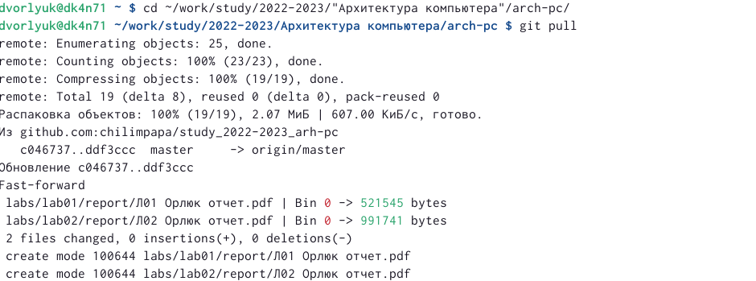

---
## Front matter
title: "Отчета по лабораторной работе №3"
subtitle: "Архитектура вычислительных систем"
author: "Дмитрий Владимирович Орлюк"

## Generic otions
lang: ru-RU
toc-title: "Содержание"

## Bibliography
bibliography: bib/cite.bib
csl: pandoc/csl/gost-r-7-0-5-2008-numeric.csl

## Pdf output format
toc: true # Table of contents
toc-depth: 2
lof: true # List of figures
lot: true # List of tables
fontsize: 12pt
linestretch: 1.5
papersize: a4
documentclass: scrreprt
## I18n polyglossia
polyglossia-lang:
  name: russian
  options:
	- spelling=modern
	- babelshorthands=true
polyglossia-otherlangs:
  name: english
## I18n babel
babel-lang: russian
babel-otherlangs: english
## Fonts
mainfont: PT Serif
romanfont: PT Serif
sansfont: PT Sans
monofont: PT Mono
mainfontoptions: Ligatures=TeX
romanfontoptions: Ligatures=TeX
sansfontoptions: Ligatures=TeX,Scale=MatchLowercase
monofontoptions: Scale=MatchLowercase,Scale=0.9
## Biblatex
biblatex: true
biblio-style: "gost-numeric"
biblatexoptions:
  - parentracker=true
  - backend=biber
  - hyperref=auto
  - language=auto
  - autolang=other*
  - citestyle=gost-numeric
## Pandoc-crossref LaTeX customization
figureTitle: "Рис."
tableTitle: "Таблица"
listingTitle: "Листинг"
lofTitle: "Список иллюстраций"
lotTitle: "Список таблиц"
lolTitle: "Листинги"
## Misc options
indent: true
header-includes:
  - \usepackage{indentfirst}
  - \usepackage{float} # keep figures where there are in the text
  - \floatplacement{figure}{H} # keep figures where there are in the text
---

# Цель работы

Целью работы является освоение процедуры оформления отчетов с помощью
легковесного языка разметки Markdown.

# Задание

1. В соответствующем каталоге сделайте отчёт по лабораторной работе No 3
в формате Markdown. В качестве отчёта необходимо предоставить отчёты
в 3 форматах: pdf, docx и md.
2. Загрузите файлы на github

# Теоретическое введение

При выполнении лабораторной работы на своей технике необходимо устано-
вить следующее ПО:
• TeX Live (https://www.tug.org/texlive/) последней версии.
• Pandoc (https://pandoc.org/) версии v2.18
• Pandoc-crossref (https://github.com/lierdakil/pandoc-crossref/releases)
версии v0.3.13.0
На компьютерах в дисплейных классах факультета физико-математических
и естественных наук РУДН все необходимое ПО установлено

# Выполнение лабораторной работы
1. Откроем терминал и перейдем в каталог курса, обновив локальный репозиторий с помощью команды "git pull".

{#fig:001 with=90%}

2. Перейдем в каталог с шаблоном отчета по лабораторной работе №3, проведем компиляцию шаблона с использованием Makefile c помощью команды "make". Удалим полученные файлы с помощью команды "rm". (Не удалилось, так как отсутствует)

{#fig:002 with=90%}

3. Откроем файл report.md с помощью тестового редактора, например gedit.

{#fig:003 with=90%}

6. Заполним отчет и скомпилируем его с использовние Makefile.

{#fig:004 with=90%}

7. Загрузим на github отчет. 

{#fig:005 width=90%}

# Выводы

Мы научились работать с Makefile и смогли сделать отчет.

# Список литературы{.unnumbered}

::: {#refs}
:::
