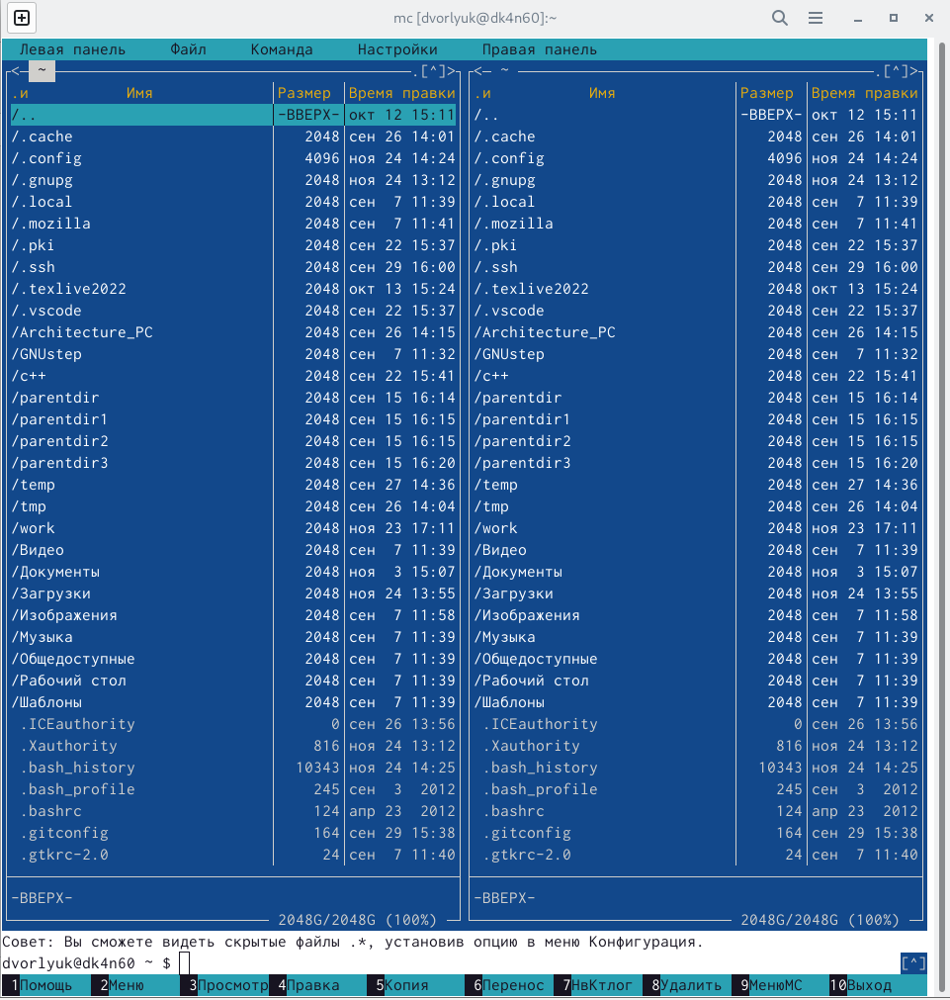
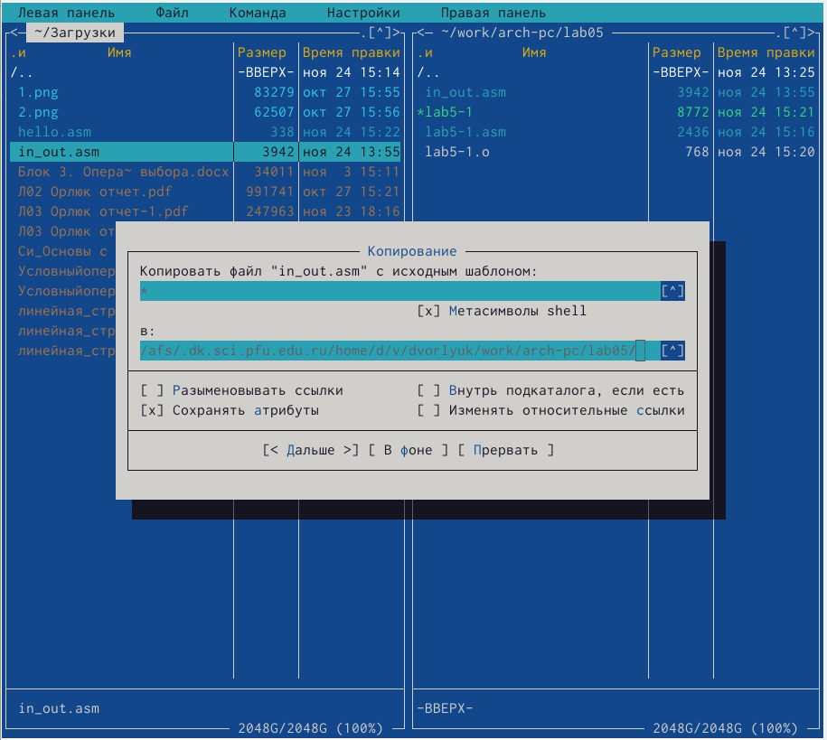

---
## Front matter
title: "Отчет по лабораторной работе №5"
subtitle: "Архитектура вычислительных систем"
author: "Дмитрий Владимирович Орлюк"

## Generic otions
lang: ru-RU
toc-title: "Содержание"

## Bibliography
bibliography: bib/cite.bib
csl: pandoc/csl/gost-r-7-0-5-2008-numeric.csl

## Pdf output format
toc: true # Table of contents
toc-depth: 2
lof: true # List of figures
lot: true # List of tables
fontsize: 12pt
linestretch: 1.5
papersize: a4
documentclass: scrreprt
## I18n polyglossia
polyglossia-lang:
  name: russian
  options:
	- spelling=modern
	- babelshorthands=true
polyglossia-otherlangs:
  name: english
## I18n babel
babel-lang: russian
babel-otherlangs: english
## Fonts
mainfont: PT Serif
romanfont: PT Serif
sansfont: PT Sans
monofont: PT Mono
mainfontoptions: Ligatures=TeX
romanfontoptions: Ligatures=TeX
sansfontoptions: Ligatures=TeX,Scale=MatchLowercase
monofontoptions: Scale=MatchLowercase,Scale=0.9
## Biblatex
biblatex: true
biblio-style: "gost-numeric"
biblatexoptions:
  - parentracker=true
  - backend=biber
  - hyperref=auto
  - language=auto
  - autolang=other*
  - citestyle=gost-numeric
## Pandoc-crossref LaTeX customization
figureTitle: "Рис."
tableTitle: "Таблица"
listingTitle: "Листинг"
lofTitle: "Список иллюстраций"
lotTitle: "Список таблиц"
lolTitle: "Листинги"
## Misc options
indent: true
header-includes:
  - \usepackage{indentfirst}
  - \usepackage{float} # keep figures where there are in the text
  - \floatplacement{figure}{H} # keep figures where there are in the text
---

# Цель работы

Приобретение практических навыков работы в Midnight Commander. Освоение
инструкций языка ассемблера mov и int

# Задание

1. Создайте копию файла lab6-1.asm. Внесите изменения в программу (без
использования внешнего файла in_out.asm), так чтобы она работала по
следующему алгоритму:
• вывести приглашение типа “Введите строку:”;
• ввести строку с клавиатуры;
• вывести введённую строку на экран.

2. Получите исполняемый файл и проверьте его работу. На приглашение
ввести строку введите свою фамилию.

3. Создайте копию файла lab6-2.asm. Исправьте текст программы с исполь-
зование подпрограмм из внешнего файла in_out.asm, так чтобы она ра-
ботала по следующему алгоритму:
• вывести приглашение типа “Введите строку:”;
• ввести строку с клавиатуры;
• вывести введённую строку на экран.

4. Создайте исполняемый файл и проверьте его работу.

# Выполнение лабораторной работы

1. С помощью команды mc откроем Mignight Commander, перейдем в нужный каталог

{ #fig:001 width=90% }

2. С помощью F7 создаем папку lab05

{ #fig:002 width=90% }

3. Убедимся, что папка создана!

{ #fig:003 width=90% }

4. С помощью строки ввода создадим файл lab5-1 в формате .asm

{ #fig:004 width=90% }

5. С помощью клавиши F4 откроем файл и внесем нужный текст из листинга 6.1

{ #fig:005 width=90% }

6. Убедимся, что текст добавлен простым путем открытия файла

{ #fig:006 width=90% }

7. Оттранслируем текст программы в объектный файл, путем нескольких команд, затем проверим работоспособность.

{ #fig:007 width=90% }

8. Файл из ТУИС скачаем, с помощью F5 перенесем в тот каталог, где лежит файл с программой.

{ #fig:008 width=90% }

9. С помощью клавиши F6 создадим копию файла lab5-1 с именем lab6-2

{ #fig:009 width=90% }

10. Внесем нужные изменения в файл с помощью команды mcedit 

{ #fig:010 width=90% }

11. Проверим, что текст изменен, простым путем открытия файла

{ #fig:011 width=90% }

12. Проверим работу файла 

{ #fig:012 width=90% }

13. (Задание из ср) Редактируем файл asm так, чтоб при вводе нужного текста, он отображался на новой. Для этого, допишем нужные команды (В КОНЕЦ НАПИШЕМ ВЫЗОВ ПРОГРАММЫ ЗАВЕРШЕНИЯ)

{ #fig:130 width=90% }

14. Оттранслируем текст программы в объектный файл.

{ #fig:131 width=90% }

15. Проверим работоспособность

{ #fig:132 width=90% }

# Выводы

В ходе лабораторной работы мною были приобретены практические навыки работы в Midnight Commander, а также освоены инструкции языка ассемблера mov и int. Я научился работать с MC, и с его помощью работать с файлами (Создание, переименовывание, копирование, перемещение, удаление, и тд.)

# Список литературы{.unnumbered}

