---
## Front matter
title: "Лабораторная работа №6"
subtitle: "Архитектура вычислительных систем"
author: "Дмитрий Владимирович Орлюк"

## Generic otions
lang: ru-RU
toc-title: "Содержание"

## Bibliography
bibliography: bib/cite.bib
csl: pandoc/csl/gost-r-7-0-5-2008-numeric.csl

## Pdf output format
toc: true # Table of contents
toc-depth: 2
lof: true # List of figures
lot: true # List of tables
fontsize: 12pt
linestretch: 1.5
papersize: a4
documentclass: scrreprt
## I18n polyglossia
polyglossia-lang:
  name: russian
  options:
	- spelling=modern
	- babelshorthands=true
polyglossia-otherlangs:
  name: english
## I18n babel
babel-lang: russian
babel-otherlangs: english
## Fonts
mainfont: PT Serif
romanfont: PT Serif
sansfont: PT Sans
monofont: PT Mono
mainfontoptions: Ligatures=TeX
romanfontoptions: Ligatures=TeX
sansfontoptions: Ligatures=TeX,Scale=MatchLowercase
monofontoptions: Scale=MatchLowercase,Scale=0.9
## Biblatex
biblatex: true
biblio-style: "gost-numeric"
biblatexoptions:
  - parentracker=true
  - backend=biber
  - hyperref=auto
  - language=auto
  - autolang=other*
  - citestyle=gost-numeric
## Pandoc-crossref LaTeX customization
figureTitle: "Рис."
tableTitle: "Таблица"
listingTitle: "Листинг"
lofTitle: "Список иллюстраций"
lotTitle: "Список таблиц"
lolTitle: "Листинги"
## Misc options
indent: true
header-includes:
  - \usepackage{indentfirst}
  - \usepackage{float} # keep figures where there are in the text
  - \floatplacement{figure}{H} # keep figures where there are in the text
---

# Цель работы

Освоение арифметических инструкций языка ассемблера NASM.

# Задание

1. Написать программу вычисления выражения 𝑦 = 𝑓(𝑥). Программа должна
выводить выражение для вычисления, выводить запрос на ввод значения
𝑥, вычислять заданное выражение в зависимости от введенного 𝑥, выво-
дить результат вычислений. Вид функции 𝑓(𝑥) выбрать из таблицы 6.3
вариантов заданий в соответствии с номером полученным при выполне-
нии лабораторной работы. Создайте исполняемый файл и проверьте его
работу для значений 𝑥1 и 𝑥2 из 6.3

# Выполнение лабораторной работы

1. Создадим каталог для программ л.р №6, перейдем в него и создадим файл

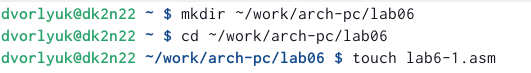{ #fig:001 width=90% }

2. Введем в файл текст программы из листинга, с помощью MC

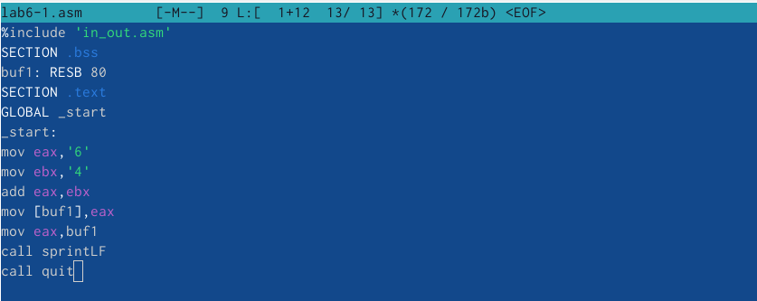{ #fig:002 width=90% }

3. Создаем исполняемый файл и запускаем

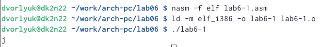{ #fig:003 width=90% }

4. Изменим текст программы (уберем кавычки)

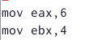{ #fig:004 width=90% }

5. Создаем исполняемый файл и запускаем его.

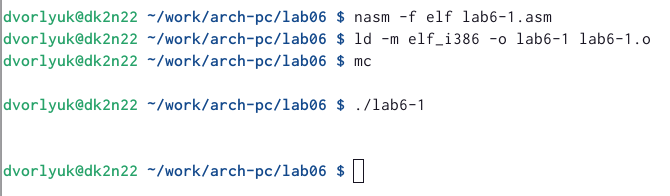{ #fig:005 width=90% }

6. Просмотрим по таблице ASCII определим какому символу соответствует код 10. Символ не отображается.

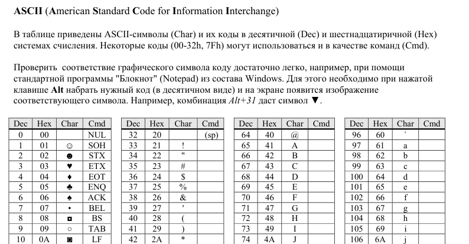{ #fig:006 width=90% }

7. Создадим файл ассемблера с помощью команды touch

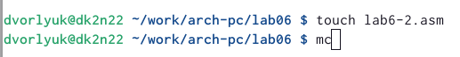{ #fig:007 width=90% }

8. Введем команду из листинга 6.2

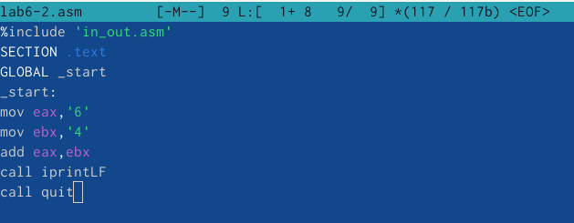{ #fig:008 width=90% }

9. Создаем исполняемый файл и запускаем его.

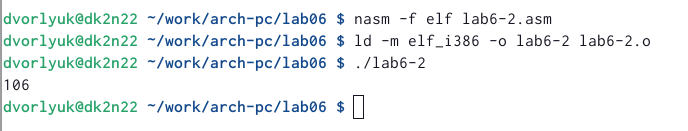{ #fig:009 width=90% }

10. Вводим нужные изменения в текст программы

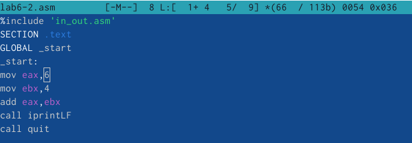{ #fig:010 width=90% }

11. Создадим исполняемый файл и проверим его работоспособность (Команда выводит просто число 10. Команды iprint и iprintLF отличаются тем, что LF - это перенос на новую строку)

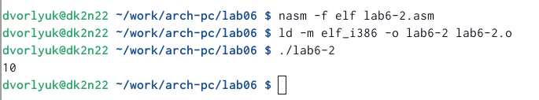{ #fig:011 width=90% }

12. Создадим файл 6-3 с помощью команды touch

{ #fig:012 width=90% }

13. Вставим текст из листинга. 

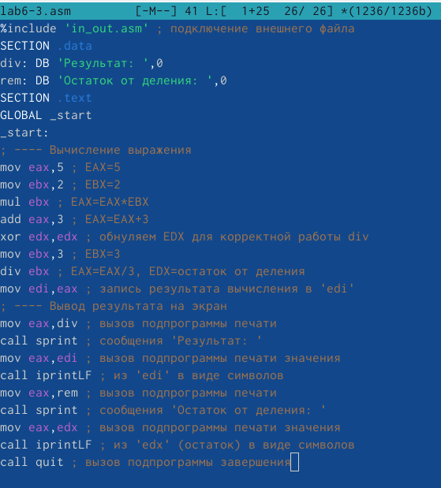{ #fig:013 width=90% }

14. Создадим исполняемый файл и запустим.

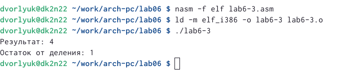{ #fig:014 width=90% }

15. Меняем текст программы для вычисления другого выражения.

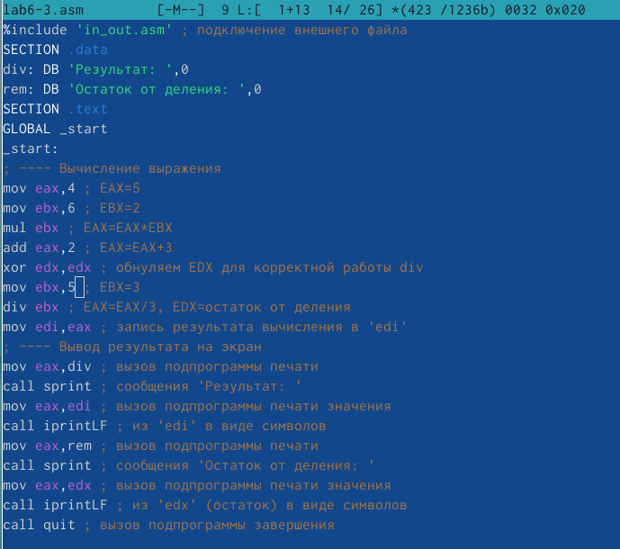{ #fig:015 width=90% }

16. Проверяем работоспособность 

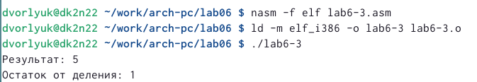{ #fig:016 width=90% }

17. Создадим файл под названием vаriant

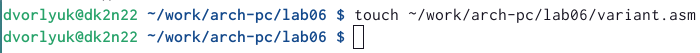{ #fig:017 width=90% }

18. Вставка нужной программы 

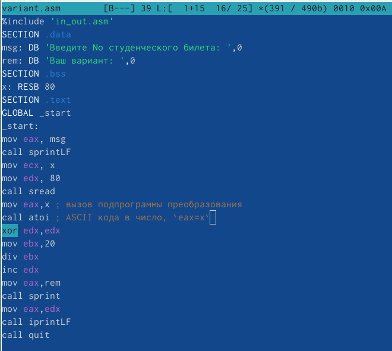{ #fig:018 width=90% }

19. Проверка работоспособности

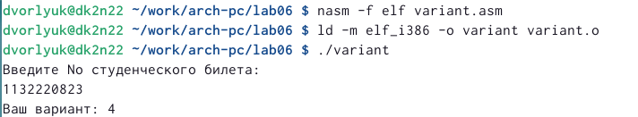{ #fig:019 width=90% }

#Ответы на вопросы 

1. Какие строки листинга 7.4 отвечают за вывод на экран сообщения 'Ваш вариант:' 
Строчка rem: DB "Ваш вариант: ',0 отвечает за вывод сообщения. 

2. Для чего используется следующие инструкции? nasm mov ecx, x mov edx, 80 call sread

3. Для чего используется инструкция "call atoi"? 
Функция call atoi преобразует ascii-код символа в целое число и записывает результат в регистр еах. 

4. Какие строки листинга 7.4 отвечают за вычисления варианта? 
mov eax, msg
call sprintLF

5. В какой регистр записывается остаток от деления при выполнении инструкции "div ebx"? 
Остаток записывается в регистр ah. 

6. Для чего используется инструкция "inc edx"? 
Команда inc edx увеличивает значение регистра edx на 

7. Какие строки листинга 7.4 отвечают за вывод на экран результата вычислений?
mov eax,rem
call sprint
mov eax,edx
call iprintLF
call quit

# Выводы

Я освоил арифметические инструкции языка ассемблера NASM, а также узнал как записывать в МС все действия с числами

